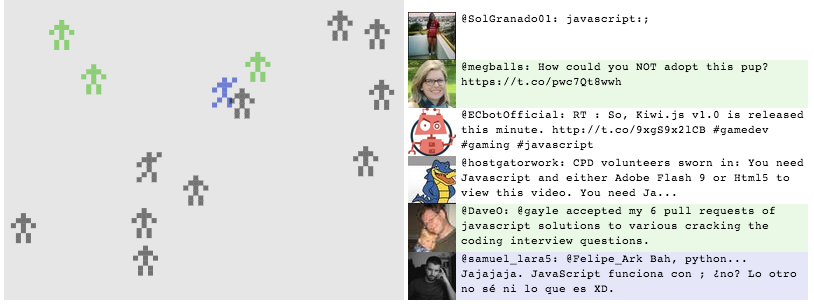

# Sentiment Peeps

This repo contains a small demo of Server Sent Events. These turned out to be trivial to implement,
and may prove more robust over a complex or locked down network than WebSockets.

Since SSE imply both a client and a server, this repo includes both. The server uses the twitter
streaming API, analyzing and filtering tweets about JavaScript. These are then broadcast to
connected clients. i.e. a single twitter stream can be consumed, processed and broadcast to many
clients. The clients use the processed data to display sprites (peeps) on a canvas.

The Node app requires Twitter app credentials. To run it you'll need to create one. See the config
module for how to pass these credentials in.

Be warned! This code was thrown together fast. Expect it to be ugly and dumb in places.

